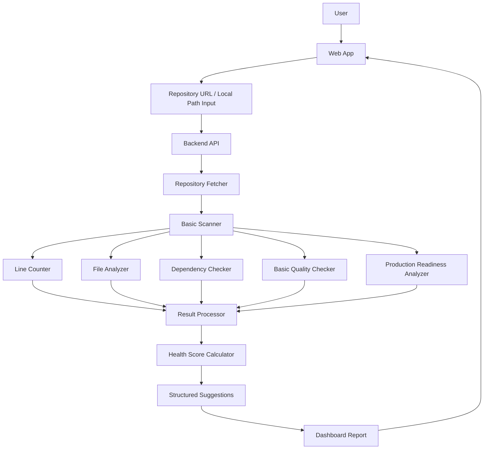

# Architecture

This foundation architecture shows the main flow for scanning a repository and turning the scan output into dashboard reports and production-focused suggestions.

```mermaid
flowchart TD
    A["User"] --> B["Web App"]
    B --> C["Repository URL / Local Path Input"]
    C --> D["Backend API"]
    D --> E["Repository Fetcher"]
    E --> F["Basic Scanner"]

    F --> G["Line Counter"]
    F --> H["File Analyzer"]
    F --> I["Dependency Checker"]
    F --> J["Basic Quality Checker"]
    F --> K["Production Readiness Analyzer"]

    G --> L["Result Processor"]
    H --> L
    I --> L
    J --> L
    K --> L

    L --> M["Health Score Calculator"]
    M --> N["Structured Suggestions"]
    N --> O["Dashboard Report"]
    O --> B
```

